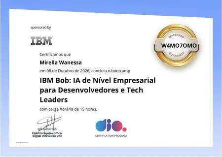

# TaskFlow

<p>
  
  
</p>

<br clear="both">

---

## Sobre

O **TaskFlow** é um produto desenvolvido do zero para praticar desenvolvimento fullstack com o apoio de agentes de Inteligência Artificial.

O projeto combina gerenciamento de tarefas, autenticação, dashboard, perfil, configurações e um assistente de IA integrado.

Desenvolvido como projeto prático para a **[DIO.me](https://dio.me)**.

---

## Funcionalidades

- Cadastro e login com JWT e bcrypt
- Criação, conclusão e exclusão de tarefas
- Busca e filtros por status
- Dashboard com estatísticas
- Perfil com avatar e bio
- Histórico de conversas com IA
- Assistente Flow integrado ao Google Gemini
- Configurações de conta
- Persistência em SQLite e `localStorage`
- Interface responsiva

---

## Tecnologias

### Frontend

| Tecnologia | Uso |
|---|---|
| React | Interface |
| TypeScript | Tipagem |
| Vite | Desenvolvimento e build |
| Tailwind CSS | Estilização |
| Lucide React | Ícones |

### Backend

| Tecnologia | Uso |
|---|---|
| Node.js | Runtime |
| Express | API |
| SQLite | Banco de dados |
| bcryptjs | Hash de senhas |
| JWT | Autenticação |
| Multer | Upload de imagens |

### IA & Deploy

| Tecnologia | Uso |
|---|---|
| Google Gemini | Assistente Flow |
| IBM Bob | Agente de desenvolvimento |
| Vercel | Frontend |
| Render | Backend |

---

## Estrutura

```text
TaskFlow/
├── src/
│   ├── components/
│   ├── hooks/
│   ├── services/
│   └── types/
│
├── server/
│   └── src/
│       ├── middleware/
│       └── routes/
│
├── docs/
├── README.md
└── package.json

```
Instalação
Pré-requisitos
Node.js 18+
Git
1. Clone

```
git clone https://github.com/Mirellawanessa/TASKFLOW-IBM-Bob.git
cd TASKFLOW-IBM-Bob
```

3. Instale as dependências

```
npm install
cd server
npm install
cd ..
```

5. Configure o ambiente

Na raiz, crie .env:

```
VITE_API_URL=http://localhost:3001
```

Em server/.env:

```
GEMINI_API_KEY=sua_chave
JWT_SECRET=sua_chave_secreta
```

4. Execute

Backend:

```
cd server
npm run dev
```

Frontend:

```
npm run dev
```

Acesse:

```
http://localhost:5173
```

## API

| Método | Rota | Função |
|---|---|---|
| `POST` | `/auth/register` | Cadastro |
| `POST` | `/auth/login` | Login |
| `GET` | `/tasks` | Listar tarefas |
| `POST` | `/tasks` | Criar tarefa |
| `PATCH` | `/tasks/:id` | Atualizar tarefa |
| `DELETE` | `/tasks/:id` | Excluir tarefa |
| `GET` | `/profile` | Obter perfil |
| `PATCH` | `/profile` | Atualizar perfil |
| `POST` | `/ai/chat` | Conversar com a IA |

---

## IBM Bob

O **IBM Bob** foi utilizado como agente de desenvolvimento durante o projeto, auxiliando em:

- Planejamento
- Arquitetura
- Implementação
- Integração com IA
- Debugging
- Documentação

---

## 🎓 Certificado

Certificado de conclusão do desafio **Construindo Seu Primeiro Produto com um Agente de IA**, realizado pela [DIO.me](https://dio.me).

<p align="center">
  
</p>


> **O IBM Bob foi utilizado como parceiro de desenvolvimento e aprendizado, acelerando a construção do produto e apoiando as decisões técnicas.**


---

### 🤝 Connect with me

[](https://www.linkedin.com/in/mirellawanessa/)  
[](https://www.instagram.com/myfilearchive)
